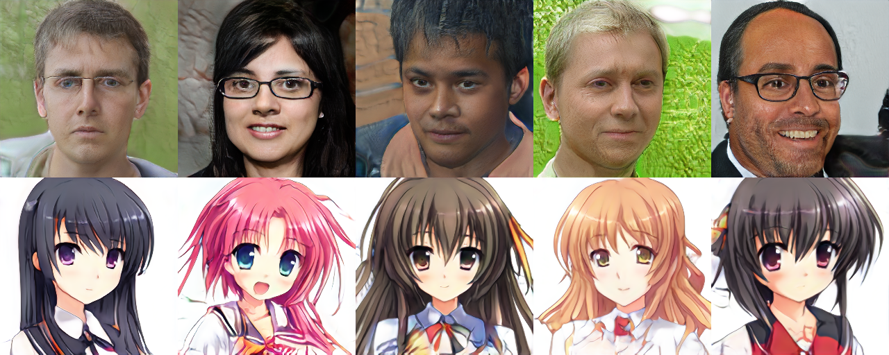

# StyleGAN-TensorFlow
A implementation of StyleGAN using Tensorflow

This implementation is on experiment and has many issues.

official paper: https://arxiv.org/abs/1812.04948

official implementation: https://github.com/NVlabs/stylegan

This code is based on [my PGGAN implementation.](https://github.com/itsuki8914/PGGAN-TensorFlow)



## Usage

1. Download ffhq-dataset from [here.](https://github.com/NVlabs/ffhq-dataset)

2. Put images1024x1024 in ffhq_dataset and thumbnails128x128 in ffhq_dataset128.

like this

```
...
│
├── ffhq_dataset
│     ├── 00000.png
│     ├── 00001.png
│     ├── ...
│     └── 69999.png
├── ffhq_dataset128
│     ├── 00000.png
│     ├── 00001.png
│     ├── ...
│     └── 69999.png 
├── main.py
├── model.py
...
```

3. Train StyleGAN.

```
python main.py
```

4. After training, inference can be performed.

to draw uncurated images,
```
python pred.py -m uc
```


to draw truncation trick images,
```
python pred.py -m tt
```


to draw style mixing images,
```
python pred.py -m sm
```


